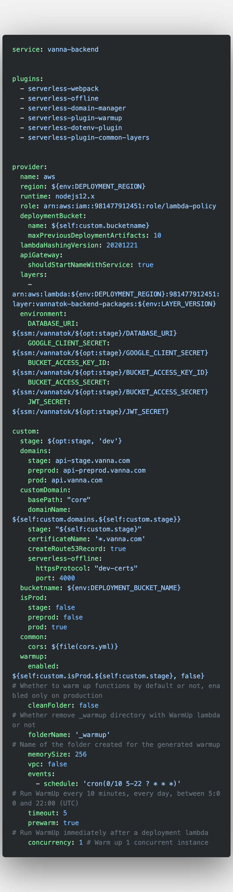

# vannatok-backend
This is core backend application for Learnreel (subsidiary of vannatok) product.

# Requirement
NodeJs 12.x

# Steps to install packages
```bash
npm install
```

# Steps to run locally
```bash
./node_modules/.bin/sls offline
```
Which should result in:
```bash
offline: Starting Offline: dev/ap-northeast-1.
offline: Offline [http for lambda] listening on http://localhost:3002
offline: Function names exposed for local invocation by aws-sdk:
           * index: vanna-backend-dev-index

   ┌─────────────────────────────────────────────────────────────────────────┐
   │                                                                         │
   │   GET | http://localhost:3000/dev/hello                                 │
   │   POST | http://localhost:3000/2015-03-31/functions/index/invocations   │
   │                                                                         │
   └─────────────────────────────────────────────────────────────────────────┘

offline: [HTTP] server ready: http://localhost:3000 🚀
```

# Application Images

  


# Code Screenshots



